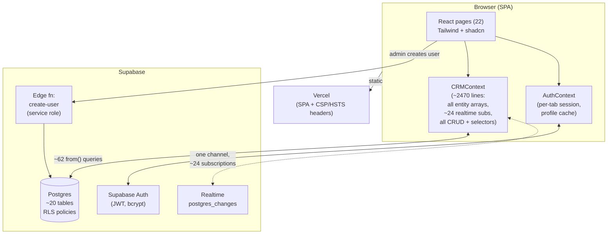
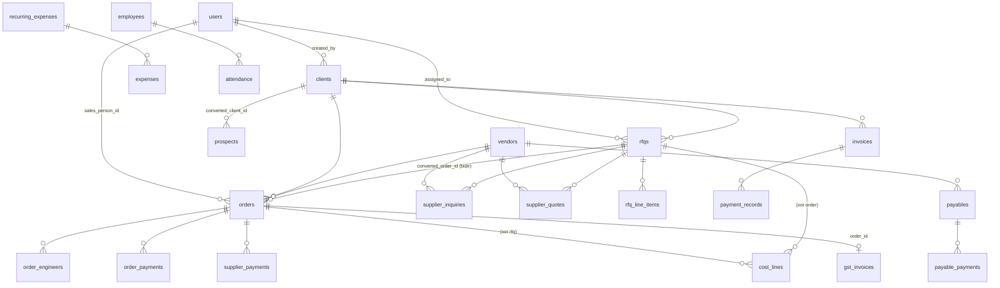
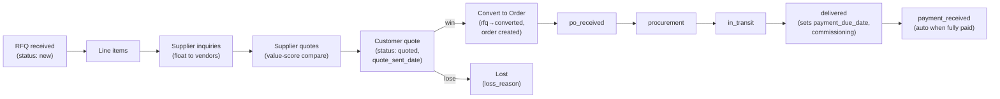
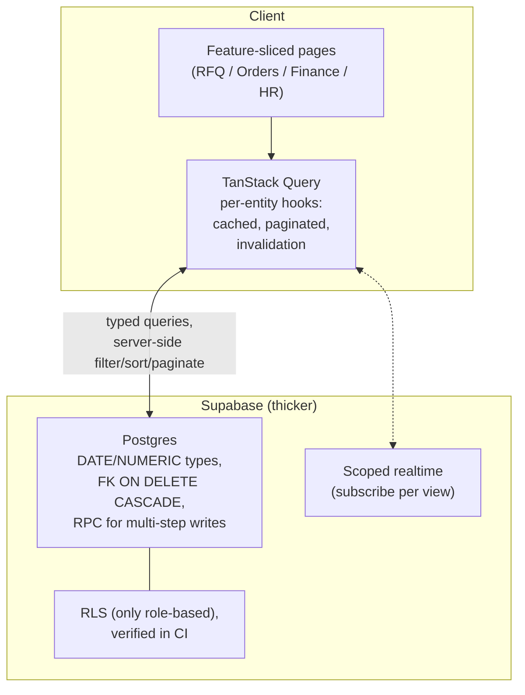

# Q-Tech CRM — Architecture & Rebuild Guide

**A complete technical account of the current system, and what to change if rebuilding it.**

- **Product:** Industrial-engineering trading CRM for a Pakistani import/distribution business (RFQ → supplier quotes → customer quote → order/PO → delivery/commissioning → invoice → payment → GST/FBR filing), plus finance/bookkeeping, costing, and HR/attendance.
- **Stack:** Vite + React 18 + TypeScript, Supabase (Postgres + Auth + Realtime), Tailwind + shadcn/ui, deployed on Vercel.
- **Scale today:** ~21,000 lines of TS/TSX, 22 pages, ~20 Postgres tables, single-tenant, small record counts.
- **Origin:** Scaffolded by Lovable; evolved heavily by hand.

> This document is written so a new team could **rebuild the system from scratch** and improve it. Each section describes *what exists*; §15–16 give the candid critique and the target architecture.

---

## 1. Executive summary

Q-Tech CRM digitizes the full life of a deal at an equipment-import trading company: a customer sends a Request-for-Quote, the team floats it to overseas suppliers, collects supplier quotes, prices a customer quote using a bespoke **landed-cost engine** (freight + duty + WHT + margin + 18% GST), converts the winning quote into an order/PO, tracks procurement → in-transit → delivery → commissioning, then manages invoicing, customer/supplier payments, and the **Pakistani GST/FBR sales-tax filing** lifecycle (TCS courier trail → PSID → WASIF & Co receipt → tax deposit). Around this core sit finance/bookkeeping (AR/AP aging, cashflow, profitability), an HR module (roster + attendance), and a follow-up/task engine that auto-nudges stalled work.

**Architecturally**, it is a single-page React app with **one giant client-side state container** (`CRMContext`, ~2,470 lines) that loads the entire database into memory, holds ~24 realtime subscriptions, and exposes ~120 fields/functions through `useCRM()`. Auth is Supabase Auth with **per-tab sessions**. Security is enforced (intended) via Postgres **Row-Level Security**, with client-side role gating as UX sugar.

**The strengths worth preserving:** the domain modeling, the costing engine (ported, unit-tested, exact to the decimal), the business-date discipline (Asia/Karachi), the paisa-safe money math, the GST/FBR workflow, and a genuinely good security-headers/CSP layer.

**The weaknesses to fix on rebuild:** the monolithic in-memory context won't scale (loads all rows, no pagination/caching despite React Query being installed); TypeScript strictness is turned **off**; there are **no component/integration/E2E tests**; deletes cascade via non-transactional app code; and RLS enablement is documented-but-unverified. Details in §15–16.

---

## 2. Domain & glossary

| Term | Meaning |
|---|---|
| **RFQ** | Request for Quote from a customer. The root of the workflow. |
| **Supplier inquiry** | An RFQ floated to an overseas vendor for pricing. |
| **Supplier quote** | A vendor's price response; compared by a value-score. |
| **Order / PO** | A confirmed customer purchase order, converted from a quoted RFQ. |
| **Costing / landed cost** | Price build-up: goods + freight + duty + WHT + margin + GST. |
| **GST** | General Sales Tax, 18% in Pakistan; stored GST-**inclusive** with the tax portion split out. |
| **TCS** | Courier used to deliver invoices/goods; its dispatch/receipt are tracked. |
| **FBR** | Federal Board of Revenue (tax authority). Sales-tax filing lifecycle. |
| **PSID** | FBR Payment Slip ID for depositing sales tax. |
| **WASIF & Co** | External accountant/agent who issues the filing receipt. |
| **WHT** | Withholding tax (default 5%). |
| **Commissioning** | On-site engineer installation of delivered equipment. |
| **Business date** | A date computed in Asia/Karachi (UTC+5), stored as `YYYY-MM-DD` text. |

Roles: **admin** (everything), **sales** (RFQ/order/costing/GST pipeline), **engineer** (only their commissioning jobs).

---

## 3. Technology stack

| Area | Choice | Version | Notes |
|---|---|---|---|
| UI runtime | React / React-DOM | 18.3 | function components + hooks |
| Build | Vite + `@vitejs/plugin-react-swc` | 5.4 / 3.11 | SWC transform; dev port **8080** |
| Language | TypeScript | 5.8 | **`strict:false`** (see §15) |
| Routing | react-router-dom | 6.30 | lazy per-page routes |
| Backend SDK | @supabase/supabase-js | 2.104 | Postgres + Auth + Realtime |
| Server state | @tanstack/react-query | 5.83 | **installed & mounted but unused for domain data** |
| Forms | react-hook-form + zod + @hookform/resolvers | 7.61 / 3.25 | used on some forms |
| UI primitives | ~30 @radix-ui + shadcn/ui | — | most generated primitives unused |
| Icons | lucide-react | 0.462 | |
| Toasts | sonner | 1.7 | |
| Charts | recharts | 2.15 | dashboard charts |
| Dates | date-fns | 3.6 | plus custom `lib/dates.ts` |
| Styling | Tailwind + tailwindcss-animate + typography | 3.4 | HSL CSS-variable tokens |
| Theming | manual (`data-theme` + `localStorage`) | — | `next-themes` installed but not used |
| Tests | Vitest + Testing Library; Playwright | 3.2 / 1.57 | unit-only; E2E is a stub |
| Lint | ESLint 9 flat + typescript-eslint 8 | — | unused-vars disabled |
| Host | Vercel | — | SPA rewrites + security headers |

**Env vars (only two):** `VITE_SUPABASE_URL`, `VITE_SUPABASE_ANON_KEY`. Service-role key lives only in the edge function's environment. `.env*` are gitignored; no `.env.example` present.

---

## 4. System architecture (high level)

**Key properties**
- **Thick client, thin server.** Nearly all logic (costing, aggregation, follow-up rules, cascades) runs in the browser. Supabase is Postgres + Auth + Realtime; the only server code is one edge function to create users.
- **One data context.** `CRMContext` is the single source of truth; every page consumes `useCRM()`.
- **Realtime echo.** Supabase broadcasts a client's own writes back to it, so all inserts pass through an `addUnique()` dedup guard.
- **Three-layer role gating** (must stay in sync): sidebar nav `roles[]`, `RequireRole` routes, and context load/subscription gates — with **RLS as the real backstop**.

---

## 5. Data model

### 5.1 Entity-relationship overview

### 5.2 Core CRM tables (`src/types/crm.ts`, `supabase/schema.sql`)

| Table | Key fields | Relationships / notes |
|---|---|---|
| **users** | id, name, email (UNIQUE), role (admin/sales/engineer); DB also has legacy `password TEXT` (not in TS) | referenced by nearly every `created_by`/`assigned_to`/`sales_person_id`/`engineer_id` |
| **clients** | company_name, industry, contact_person, phone, email, address, created_by | parent of rfqs, orders, invoices |
| **prospects** | company_name, status (hot/warm/cold), lead_source, follow_up_date, assigned_to, converted_client_id | converts → client |
| **vendors** | name, country, contact_person, products_supplied | overseas suppliers |
| **rfqs** | rfq_number, client_id, company_name, rfq_date, estimated_value, assigned_to, priority (high/med/low), status (new/in_progress/quoted/lost/converted), quoted_price, quote_sent_date, quote_expiry_date, quote_deadline, loss_reason, loss_notes, converted_order_id | ↔ orders (bidirectional soft-then-hard FK) |
| **rfq_line_items** | rfq_id, product_type, quantity, specification, target_price | CASCADE on rfq |
| **supplier_inquiries** | rfq_id, vendor_id, sent_at, status (pending/responded/no_response), email_draft, follow_up_date | CASCADE on rfq |
| **supplier_quotes** | rfq_id, vendor_id, inquiry_id, unit_price, currency, lead_time_days, moq, validity_days, is_selected | value-score comparison |
| **orders** | client_id, vendor_id, sales_person_id, product_type, order_value, cost_value, status (5-value lifecycle), customer_po_number, customer_po_date, payment_terms_days, delivery_date, payment_due_date, invoice_number, invoice_date, order_gst_amount, rfq_id, ops_dismissed | status locked by `orders_status_check` |
| **order_engineers** | order_id, engineer_id, site_location, start_date, expected_completion, commissioning_status | CASCADE; drives My Jobs |
| **order_payments** | order_id, amount (>0), payment_date, method, reference, recorded_by | money IN; **admin-only RLS** |
| **supplier_payments** | order_id, amount (>0), payment_date, method, reference, recorded_by | money OUT; **admin-only RLS** |
| **cost_lines** | rfq_id XOR order_id, sr, item, pn, brand, supplier, qty, unit_price, freight/packing/duty/wht/margin/gst %, mode (multi/single), loading_pct, freight_mode, config_snapshot (JSONB) | **inputs only**; money recomputed by engine on read |
| **costing_config** | id=1 singleton, freight rates (air/sea/courier/road), gst_percent, wht_percent, insurance_percent | global default rates |
| **follow_up_actions** | action_type, entity_type, entity_id (soft polymorphic), title, due_date, priority, status (pending/completed/snoozed), assigned_to, recurrence_days | one open per (entity,type) via partial unique index |
| **quarterly_targets** | year, quarter (1–4), target_value; UNIQUE(year,quarter) | dashboard sales targets |

### 5.3 Bookkeeping tables (`src/types/bookkeeping.ts`)

| Table | Key fields | Notes |
|---|---|---|
| **invoices** | invoice_number (UNIQUE), client_id, order_id, rfq_id, invoice_amount, issued_date, due_date, payment_status (Pending/Paid/Overdue/Partial), amount_paid | sequence `INV-YYYYMM-NNN` derived from DB |
| **payment_records** | invoice_id, amount, payment_date, method, recorded_by | CASCADE; recompute paid from DB |
| **expenses** | date, amount, category (free-text; CHECK dropped), description, vendor_id/rfq_id/order_id, recurring_id, period | custom categories allowed |
| **recurring_expenses** | label, category, amount, day_of_month (1–28), active, start_month | posts into expenses monthly (idempotent upsert) |
| **payables** | vendor_id, amount, due_date, payment_status, amount_paid, linked_expense_id | AP |
| **payable_payments** | payable_id, amount (>0), payment_date, method, reference | AP payment history |
| **budgets** | period, budget_type (Revenue/Expense), category, expected_amount | budget vs actual |
| **gst_invoices** | gst_invoice_number, invoice_date, client_name, supplier_company, customer_po_number, item, delivery_challan_number, amount (incl GST), gst_amount, tcs_sent_date, tcs_receipt_number, client_received_date, fbr_status (5-value), psid, wasif_receipt_received/date, tax_deposit_date/amount/bank, order_id | self-contained GST/FBR lifecycle; order link optional |

Reporting types (no tables — computed client-side): `MonthlySummary`, `QuarterlySummary`, `ProjectProfitability`, `CashflowMonth`, `ARAgingBucket`, `DashboardMetrics`.

### 5.4 HR tables (`src/types/hr.ts`)

| Table | Key fields | Notes |
|---|---|---|
| **employees** | name, employee_code, designation, department, phone, email, join_date, salary, shift_start (HH:MM), status (active/inactive) | **separate from `users`** — roster only, no login |
| **attendance** | employee_id, date, status (present/absent/leave/half_day), late, check_in, check_out | one row per employee/day (unique index, upserted) |

### 5.5 Data-model conventions & gotchas (important for a rebuild)
1. **Dates are `TEXT` (`YYYY-MM-DD`) everywhere**, not `DATE`/`TIMESTAMP`. Sorting/filtering relies on ISO string ordering. Timestamps use `TIMESTAMPTZ`.
2. **Money is stored GST-inclusive** with the GST portion split out (`gst_invoices.amount`+`gst_amount`; `orders.order_value`+`order_gst_amount`). Net/exclusive = amount − GST. `order_gst_amount` is null on legacy orders (split unknown → with==without).
3. **`cost_lines` store inputs only**; all money is recomputed by the engine on read, so a rate change never leaves stale prices. `config_snapshot` (JSONB) freezes the effective config per single-item line so saved quotes don't drift.
4. **orders ↔ rfqs is bidirectional**: columns created FK-less to avoid circular DDL, real FKs added later (`20260710_data_integrity_fks.sql`).
5. **`follow_up_actions.entity_id` is soft-polymorphic** (no FK; `entity_type` discriminates rfq/order).
6. **`users` is an app table** with a legacy plaintext `password` column distinct from Supabase Auth; RLS `created_by = auth.uid()` checks assume `users.id` equals the auth UID.

---

## 6. Database, migrations & RLS

**Base DDL:** `supabase/schema.sql` (core CRM) + `supabase/migrations/create_bookkeeping_tables.sql`. Migrations are **hand-run and idempotent** (`IF NOT EXISTS` / drop-then-create / `DO $$` guards). ~19 migration files.

### 6.1 Migration timeline (abridged)

| File | Purpose |
|---|---|
| `schema.sql` | core tables; CHECK constraints; RLS on with **open `allow_all` (USING true)** policies |
| `create_bookkeeping_tables.sql` | invoices, expenses, payment_records, payables, budgets, follow_up_actions |
| `enable_rls_security_policies.sql` | the **role-based** RLS layer (replaces open policies) |
| `phase3_recurring_actions.sql` | `recurrence_days` on follow-ups |
| `seed_historical_data.sql` | Oct 2024–Jan 2025 import (introduced invalid `'completed'` status, later fixed) |
| `20260710_delete_policies_and_quarterly_targets.sql` | quarterly_targets + the **missing DELETE policies** |
| `20260710_data_integrity_fks.sql` | adds real FKs, indexes, `UNIQUE(invoice_number)`, payable_payments |
| `20260711_finance_rebuild.sql` | order_payments + supplier_payments (**admin-only RLS**), orders.invoice_number/date |
| `20260711_fix_legacy_order_statuses.sql` | maps legacy statuses; adds `orders_status_check` |
| `20260712_costing.sql` | cost_lines + `order_gst_amount`; admin+sales RLS |
| `20260724_costing_single_item.sql` | single-item fields + `costing_config` singleton |
| `20260724_recurring_expenses.sql` | recurring templates + `uq_expenses_recurring_period` |
| `20260724_gst_invoices.sql` | GST register table |
| `20260724_employees_attendance.sql` | HR tables (**admin-only RLS**) + `uq_attendance_employee_date` |
| `20260724_admin_delete_policies.sql` | admin DELETE for rfqs/clients/vendors/prospects |
| `20260724_flexible_expense_categories.sql` | **drops** expense category CHECK (custom groups) |
| `20260724_dedupe_followups.sql` | dedup + partial unique `uq_followup_open_per_entity WHERE status='pending'` |
| `20260724_orders_ops_dismissed.sql` | `ops_dismissed` flag |

### 6.2 RLS policy model (intended, post-migration)
- **users:** self read/update (can't change own role); admin all.
- **clients/vendors:** all authed read; admin-only write/delete.
- **prospects:** all read; admin+sales insert; admin update/delete.
- **rfqs/inquiries/quotes:** all read; admin+sales insert (own); own-or-admin update; admin delete.
- **orders:** all read; admin+sales+engineer insert (own); own-or-admin update; admin delete.
- **invoices/expenses/payables/payment_records:** all read; **admin-only** write.
- **order_payments/supplier_payments:** **admin-only read AND write** (most restricted).
- **cost_lines/costing_config:** admin+sales read; engineers excluded.
- **gst_invoices:** admin+sales read+write.
- **employees/attendance:** **admin-only** read+write.
- **quarterly_targets:** public read; admin write.
- **follow_up_actions:** all read; write if assignee or admin.

### 6.3 Integrity rules enforced in the DB
- **Unique:** `users.email`, `invoices.invoice_number`, `quarterly_targets(year,quarter)`, `uq_expenses_recurring_period(recurring_id,period)`, `uq_attendance_employee_date(employee_id,date)`, partial `uq_followup_open_per_entity`.
- **CHECK:** role/status/priority enums, `orders_status_check` (5 values), `cost_lines_one_parent` (exactly one of rfq/order), `cost_lines_mode_check`, `costing_config` id=1, `day_of_month 1–28`, `quarter 1–4`, amounts `>0`, fbr_status 5-value.
- **Cascade:** `ON DELETE CASCADE` on child tables (line items, inquiries, quotes, engineers, payments, attendance); `ON DELETE SET NULL` on most user/client/vendor/rfq references (preserves history).

> ⚠️ **Two overlapping RLS layers exist** (`allow_all` from `schema.sql` vs the role-based set). Postgres RLS is permissive-OR, so if the open policies were never dropped in production, they win. A rebuild must ship **only** the role-based set and verify it (see §15).

---

## 7. Application architecture

### 7.1 Provider tree & routing (`src/App.tsx`)
`QueryClientProvider → TooltipProvider → Sonner → AuthProvider → CRMProvider → ConfirmProvider → BrowserRouter`. Every page is `React.lazy`-loaded (per-page chunks; a comment notes this also worked around a Vite bundling **TDZ crash**).

- **`ProtectedRoutes`** — shows loader while auth resolves, `LoginPage` if unauthenticated, else the `AppLayout` shell.
- **`RequireRole({roles})`** — redirects non-matching roles to `/dashboard`. **Client-side only** — RLS is the real enforcement.

Full route table in §9.

### 7.2 AuthContext (`src/contexts/AuthContext.tsx`, ~254 lines)
- Supabase `signInWithPassword`; profile (`users` row) fetched by `auth.uid()`.
- **Per-tab session:** session stored in `window.sessionStorage` (not localStorage) → closing the browser forces re-login.
- **Profile cache:** `sessionStorage('qtcrm_profile')`, **1h TTL**, cache-first render + background refresh; role revalidated on `window` focus (catches demotions fast).
- **Timeouts:** 6s DB fetch race + 8s safety net (Supabase free-tier cold starts). If the profile fetch times out after successful auth, login proceeds anyway (soft-fail).
- Exposes `user`, `loading`, `isAdmin/isSales/isEngineer`.

### 7.3 Supabase client (`src/lib/supabase.ts`)
- Single `createClient(url, anonKey)` from Vite env.
- `storage: sessionStorage`, `persistSession/autoRefreshToken/detectSessionInUrl: true`.
- **`lock: perTabLock`** — a custom **no-op** replacing supabase-js's default browser-wide Navigator Lock. With per-tab sessions, the cross-tab lock would starve two open tabs' token refresh and hang sign-in on "Authenticating…". This no-op lets each tab run its auth independently. *(Non-obvious SDK deviation — document it.)*

### 7.4 CRMContext (`src/contexts/CRMContext.tsx`, ~2,470 lines) — the "monolith"
The single source of truth for essentially all app data. Exposes ~120 fields via one `CRMContextType`.
- **State:** ~25 `useState` arrays holding the whole database in memory.
- **Loading:** one `Promise.all` of ~23 queries once a user logs in. **Role-gated**: financial/HR tables load only for admin; costing/GST for admin+sales; the rest for any authed user. Non-loaded roles resolve to empty.
- **Realtime:** one `crm-changes` channel with ~24 `postgres_changes` subscriptions (INSERT/UPDATE/DELETE → array mutations). Financial subscriptions gated to admins. Channel handle retained so cleanup can `removeChannel` (returning cleanup from inside async `load()` previously leaked a channel per HMR).
- **`addUnique()`** dedup — because Supabase echoes a client's own inserts, optimistic writes would double-add.
- **`autoFollowUp()`** — declared **before** any callback that lists it in deps (defining it later caused a production **TDZ crash**). Dedups by querying for an existing pending action before inserting.
- **Lookup maps** — `userMap/clientMap/vendorMap` memoized `Map`s for O(1) name lookups.
- **Cascade deletes** — `deleteClient/deleteRFQ/deleteOrder` manually delete dependents across separate calls (**not transactional**).
- **Race-safety** — payment flows recompute totals from the DB and compare in **paisa** (`Math.round(x*100)`) to dodge float equality and concurrent double-counting.

> `@tanstack/react-query` is installed and its provider mounted, but domain data does **not** flow through it — no caching/pagination/invalidation. It's effectively dead weight for the core flows.

---

## 8. Core business workflows

### 8.1 RFQ → Order lifecycle

- **Order status is strictly linear** — `allowedTransitions` (`CRMContext.tsx:33`) rejects skips/reversals.
- Each stage schedules an **auto follow-up** (float RFQ @1d, chase supplier @48h, chase client @3d, pay supplier @5d, overdue invoice after delivery).
- `delivered` stamps `delivery_date` and computes `payment_due_date = today + payment_terms_days` (default 30).
- **Payments:** `addOrderPayment` recomputes total paid from the DB (race-safe); a fully-paid `delivered` order auto-advances to `payment_received`. `addSupplierPayment` tracks money out.
- **Stall detection:** once per session, scans for floated-no-quote >7d, quoted-no-decision >7d, orders stuck early >30d, and raises deduped follow-ups.

### 8.2 GST/FBR filing lifecycle (`GstRegisterPage`, `lib/gst/fbr.ts`)
Each `gst_invoices` row moves through **Invoice & identity → TCS courier → FBR sales tax**:
`Pending → Generated → Fully Generated → Receipt Received → Deposited`, tracking `psid`, WASIF receipt, and tax deposit. `needsFbrAttention()` flags any prior-month invoice not yet Deposited (amber "chase WASIF"). Live 18% check: expected GST = `amount × 18/118`, warns (never blocks) on drift with a one-click "Use 18%" fix. Sort by GST invoice number; search, filter, paginate, CSV export, and a read-only detail view (with Net excl-GST).

### 8.3 Costing engine (`lib/costing/qtech-costing.ts`)
Zero-dependency, ported from a desktop app, unit-tested to the decimal.
- **Multi-item:** `unitCf = price+freight+packing → ×(1+duty)×exch → ×(1+wht) → ×(1+margin) → ×(1+gst)`; rolls up excl/GST/incl/cost/gross-profit.
- **Single-item:** loading % + PKR freight rates (Air/Sea/Courier/Road) + insurance + fixed charges + WHT + margin + GST.
- `distribution()` splits the incl-GST price into 7 buckets that sum exactly to total (the "where the money goes" bar).
- `apply.ts` normalizes either model to `order_value` / `order_gst_amount` / `cost_value` for saving to an RFQ/order.

### 8.4 Finance / bookkeeping (`FinancePage`, admin-only)
Invoices (DB-derived numbering, retry on unique violation), expenses + recurring templates (idempotent monthly posting), payables. Memoized selectors: `getDashboardMetrics`, `getMonthlySummary`, `getProjectProfitability`, `getCashflowStatement` (true cash by payment date), AR/AP aging buckets, profitability metrics (avg margin, low-margin count).

### 8.5 Follow-up / task engine (`ActionsPage`, `lib/sequences.ts`)
CRUD + snooze + complete-with-outcome + recurrence (`recurrence_days`), bulk `applySequence` (4 built-in cadences), pattern insights (avg days-to-completion), workload. Drives the sidebar urgent badge.

---

## 9. Page & route inventory

| Path | Page | Access |
|---|---|---|
| `/dashboard` | KPIs, quarterly targets, pipeline, recent orders (engineers → my-jobs) | all |
| `/clients`, `/clients/:id` | client directory + detail | admin, sales |
| `/prospects`, `/prospects/:id` | lead pipeline (hot/warm/cold), convert → client | admin, sales |
| `/rfqs`, `/rfqs/:id` | RFQ list + **central workflow hub** (line items, inquiries, quotes, costing, convert) | admin, sales |
| `/daily-rfq-report` | funnel analytics + CSV | admin, sales |
| `/operations` | 5 worklists (not floated / awaiting supplier / awaiting customer / in progress / overdue payments) | admin, sales |
| `/actions` | follow-up inbox by urgency tier | admin, sales |
| `/orders`, `/orders/:id` | order lifecycle, PO/invoice/payments, cost inputs, engineers | admin, sales |
| `/vendors`, `/vendors/:id` | supplier directory + detail | admin, sales |
| `/costing` | standalone calculator (single/multi + config) | admin, sales |
| `/gst-register` | GST/FBR register | admin, sales |
| `/finance` | bookkeeping (AR/AP, cashflow, recurring, profitability) | **admin** |
| `/employees` | HR roster + attendance | **admin** |
| `/team` | user management (create app users) | **admin** |
| `/my-jobs` | engineer commissioning jobs | engineer, admin |

**Largest page files (decomposition candidates):** `RFQDetailPage` 1,345 · `FinancePage` 968 · `ActionsPage` 839 · `RFQsPage` 812 · `DashboardPage` 697 · `GstRegisterPage` 578 · `OrdersPage` 567.

---

## 10. Business-logic libraries (`src/lib/`)

| Module | Responsibility |
|---|---|
| `dates.ts` | Asia/Karachi business dates; `businessToday`, `businessDaysFromNow`, month bounds. **Use everywhere instead of `toISOString()`** (fixes 00:00–05:00 off-by-one). |
| `format.ts` | `formatPKR` (en-PK, no decimals), `formatDate` (dd Mon yyyy, `—` for null). |
| `costing/*` | engine (`qtech-costing`), `distribution`, `apply`, `mapping`, `schemas` — each with `.test.ts`. |
| `gst/fbr.ts` | `needsFbrAttention`. Tested. |
| `hr/attendance.ts` | `isLate`, `summarizeMonth`, `recordsByEmployeeForDate`. Tested. |
| `finance/recurring.ts` | recurring-expense posting/dedup. Tested. |
| `sequences.ts` | 4 built-in follow-up cadences. |
| `lossReasons.ts` | 8 categorized RFQ loss reasons. |
| `csvExport.ts` | CSV with **formula-injection guard** + quote escaping. |
| `utils.ts` | `cn` (clsx + tailwind-merge). |

---

## 11. Design system & UI patterns

- **Tokens (`src/index.css`, ~342 lines):** HSL CSS variables; **dark default**, light under `:root[data-theme="light"]`; theme applied pre-React (inline script in `index.html`) and persisted in `localStorage('qtcrm_theme')`. Brand emerald/teal (`158 60% 40%`), semantic success/warning/info + lead-temperature hot/warm/cold.
- **Font:** Plus Jakarta Sans; Tailwind `fontSize` scale overridden for reading ease (xs=13px … 2xl=25px).
- **Component classes:** `.glass-card`, `.kpi-card`, `.modal-card`, `.section-title`, alert banners, animations (`fade-in`, `slide-in-left`, `badge-pulse`). **`backdrop-blur` deliberately removed** (site-wide repaint jank).
- **Reusable pieces:** promise-based `useConfirm()` dialog, controlled `Pagination`, skeleton family (`TableSkeleton`, `DashboardSkeleton`), shadcn/ui primitives (mostly unused).

---

## 12. Auth & security posture

- **Login:** Supabase Auth (bcrypt, JWT), Zod-validated form, per-tab session.
- **Route guards:** client-side only (UX); **RLS is the enforcement boundary**.
- **User creation:** Deno edge function `create-user` uses the service-role key, verifies the caller is admin, rolls back the auth user if the profile upsert fails. *(CORS is `*` — tighten.)*
- **Headers (`vercel.json`) — genuinely strong:** CSP (`default-src 'self'`; connect self + `*.supabase.co`/`wss`), HSTS (1yr, preload), `X-Frame-Options: DENY`, `frame-ancestors 'none'`, `nosniff`, Referrer-Policy, Permissions-Policy disabling camera/mic/geo/payment.
- **Documented remediation (`docs/*.md`, dated 2026-04-28):** describes fixing an alarming original state — plaintext passwords, **password sent in the URL query string**, and **RLS disabled**. The fixes are code-ready but several critical steps (rotate anon key, migrate users to Auth, **enable RLS**, **drop the password column**) are **manual and unverified in-repo** — one doc still reads "RLS: 🔴 DISABLED".

> **Security bottom line for a rebuild:** treat *RLS-enabled-and-verified* and *no plaintext password column* as non-negotiable baselines proven by tests/CI, not checklist items.

---

## 13. Testing

- **Unit (Vitest + jsdom):** ~12 files, all pure logic — costing (×4), finance/recurring, gst/fbr, hr/attendance, csvExport, dates, format, lossReasons.
- **E2E (Playwright):** config/fixture are **stubs** re-exporting `lovable-agent-playwright-config`; **no actual specs**.
- **Coverage gap:** zero component, integration, or E2E tests. The entire data layer (`CRMContext`, ~62 `from()` calls), auth flow, RLS behavior, routing/role guards, and all 22 pages are **untested**.

---

## 14. Deployment & operations

- **Vercel** SPA; `vercel.json` rewrites `/(.*) → /index.html` + the header block.
- Build output `dist/` (~1.3 MB); manual vendor chunks (`vendor-react`, `vendor-charts`, `vendor-supabase`).
- **Two-repo reality:** this working copy's `origin` is the **deployed** repo `abz1014/Qtech-CRM`; pushes to `main` auto-deploy. (Watch for drift with any separate Lovable-synced repo.)
- Supabase migrations are **applied by hand** (no CI migration step); the Supabase CLI is linked under `supabase/.temp/`.
- **Minor drift to fix:** dev port 8080 (Vite) vs 5173 (`.claude/launch.json`); `next-themes`/`react-query` installed but unused; a `reset-password.mjs` referenced in `.claude` but absent.

---

## 15. Candid assessment — what's weak

| # | Issue | Evidence | Impact |
|---|---|---|---|
| 1 | **Monolithic in-memory state** | `CRMContext.tsx` ~2,470 lines; loads all rows of all tables; ~24 live subscriptions | Won't scale past small record counts; broad re-renders; merge-conflict magnet |
| 2 | **React Query installed but unused** for domain data | provider mounted; data via Context | no caching/pagination/invalidation; dead weight |
| 3 | **TypeScript strictness off** | `strict:false`, `strictNullChecks:false`, `noImplicitAny:false`; unused-vars lint off | type safety largely forfeited across 21k lines |
| 4 | **No component/integration/E2E tests** | Playwright is a stub | high regression risk on the untested core |
| 5 | **Non-transactional cascades** | `deleteClient` deletes dependents across separate calls | a mid-sequence failure orphans rows |
| 6 | **RLS enablement documented-but-unverified** | one doc still says "RLS DISABLED"; two overlapping policy layers | potential data exposure if `allow_all` still live |
| 7 | **Legacy plaintext `password` column** on `users` | schema + cleanup checklist | must be dropped & proven gone |
| 8 | **Dates as TEXT** | `YYYY-MM-DD` strings everywhere | no DB date math; relies on string ordering |
| 9 | **Doc sprawl** | `audit/` (18 files), `docs/` (security), 44 KB `PRODUCT_BIBLE.md`, Lovable placeholder README | point-in-time docs rot |
| 10 | **Oversized pages** | `RFQDetailPage` 1,345 lines etc. | hard to test/maintain |
| 11 | **TDZ workarounds** | lazy routes + "declare autoFollowUp first" comments | fragile bundling assumptions |

---

## 16. Rebuild guide — what to keep, what to change

### 16.1 Keep (these are genuinely good)
- The **domain model** and the RFQ→order→GST→finance workflow — it maps the real business well.
- The **costing engine** (`lib/costing/*`) — pure, tested, portable. Lift it wholesale.
- **Business-date discipline** (`lib/dates.ts`) and **paisa-safe money math**.
- The **GST/FBR lifecycle** and the live 18% consistency check.
- The **security-headers/CSP** layer in `vercel.json`.
- The **realtime dedup** and **race-safe payment recomputation** ideas (even if the mechanism changes).

### 16.2 Change (target architecture)

1. **Replace the monolith with TanStack Query** (already a dependency). One hook per entity/query with **server-side filtering, sorting, pagination**; scoped realtime per active view instead of loading the whole DB. Split state by domain (RFQ, orders, finance, HR).
2. **Turn on `strict` TypeScript** and re-enable unused-var lint; fix fallout incrementally. Generate DB types from Supabase (`supabase gen types typescript`) so the schema is the source of truth.
3. **Move multi-step writes into the database** — FK `ON DELETE CASCADE` for real cascades, and **Postgres RPC functions** (or edge functions) for atomic operations (convert RFQ→order, record payment + advance status, delete client + dependents) so they're transactional.
4. **Make security provable:** ship only the role-based RLS, drop the plaintext `password` column, rotate the anon key, and add an **automated test that a non-admin cannot read `invoices`/`order_payments`**. Put migrations in CI.
5. **Fix the data types:** use `DATE`/`TIMESTAMPTZ` and `NUMERIC` in Postgres; keep the Asia/Karachi presentation layer.
6. **Add a real test pyramid:** unit (keep the costing tests), component tests for the top-5 pages, and Playwright E2E for auth, role guards, and the RFQ→order→payment happy path.
7. **Decompose the 500–1,345-line pages** into feature components + hooks.
8. **Consolidate documentation:** collapse `audit/` + `docs/` + `PRODUCT_BIBLE.md` into a single living architecture doc (this one), and write a real README.
9. **Reconsider per-tab auth + the no-op lock:** if you keep per-tab sessions, document why; otherwise use standard localStorage sessions and drop the custom lock.
10. **Clean the toolchain:** remove unused deps (`next-themes`), align dev ports, and add a CI step that runs typecheck + lint + unit tests + a migration dry-run on every push.

### 16.3 Suggested rebuild sequence
1. Stand up Postgres schema with proper types, FKs, and **only** role-based RLS; generate TS types; verify RLS with tests.
2. Port the costing engine and pure libs (dates/format/gst/finance) unchanged.
3. Build the data layer as TanStack Query hooks (paginated, scoped realtime).
4. Rebuild pages feature-by-feature in dependency order: auth → clients/vendors → RFQ → orders → GST → finance → HR.
5. Migrate data from the current DB (dates → `DATE`, split any remaining plaintext passwords into Auth).
6. Wire CI (typecheck/lint/test/migration) and E2E before cutover.

---

## 17. Appendix — key file map

| Concern | Files |
|---|---|
| Entry / routing | `src/App.tsx`, `index.html`, `src/main.tsx` |
| State | `src/contexts/CRMContext.tsx` (~2470L), `src/contexts/AuthContext.tsx` (~254L) |
| Backend client | `src/lib/supabase.ts` |
| Types | `src/types/crm.ts`, `src/types/bookkeeping.ts`, `src/types/hr.ts` |
| Business logic | `src/lib/{dates,format,csvExport,sequences,lossReasons}.ts`, `src/lib/costing/*`, `src/lib/gst/fbr.ts`, `src/lib/hr/attendance.ts`, `src/lib/finance/recurring.ts` |
| Pages | `src/pages/*` (22 files) |
| Shell / nav | `src/components/AppLayout.tsx`, `src/components/AppSidebar.tsx` |
| Reusable UI | `src/components/ui/ConfirmDialog.tsx`, `Pagination.tsx`, `ui/skeleton.tsx` |
| Design tokens | `src/index.css`, `tailwind.config.ts` |
| DB | `supabase/schema.sql`, `supabase/migrations/*` (~19), `supabase/functions/create-user/index.ts` |
| Deploy / config | `vercel.json`, `vite.config.ts`, `tsconfig*.json`, `.claude/launch.json` |
| Existing docs | `PRODUCT_BIBLE.md`, `audit/*` (18), `docs/*` (security + SQL) |

---

*Generated from a full read of the codebase. Section 16 is the actionable part if you rebuild: keep the domain model, costing engine, date/money discipline, and security headers; replace the monolithic context with cached/paginated server-state, turn on strict typing, move cascades and multi-step writes into the database, and make RLS provable with tests.*
