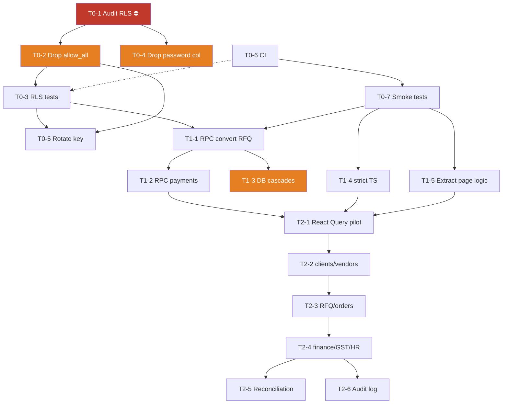

# Q-Tech CRM — Modernization Backlog

**A right-sized, ticketed execution plan.** Derived from the 24-phase enterprise roadmap, reordered so risk leads and scoped to what this system's actual size justifies (single-tenant, ~21k LOC, small record counts, a handful of users).

Companion to [CRM_ARCHITECTURE_AND_REBUILD_GUIDE.md](CRM_ARCHITECTURE_AND_REBUILD_GUIDE.md), which is the "what exists today" reference.

---

## Ground rules (carried over from the original roadmap — these were the best part)

- Never break existing functionality.
- Never rewrite without justification.
- Prefer incremental migration.
- Maintain backward compatibility whenever possible.
- Every ticket must be fully validated before the next one starts.
- No ticket is complete until its acceptance criteria pass.

**Added rule:** every ticket ships to production on its own. No long-lived branches, no big-bang merges.

---

## Effort key

| Size | Rough effort (1 dev + Claude) |
|---|---|
| **S** | ≤ 1 day |
| **M** | 2–4 days |
| **L** | 1–2 weeks |

Estimates assume the existing app stays running throughout. They are rough — treat as relative sizing, not commitments.

---

# TIER 0 — Make it safe

**Goal:** eliminate the active data-exposure risk, and build the safety net that makes every later refactor survivable.

**Why first:** RLS is currently *documented-but-unverified* — `docs/RLS_POLICIES_EXPLAINED.md` still reads "Current Status: 🔴 DISABLED", two overlapping policy layers exist (`allow_all` from `schema.sql` vs the role-based set), and `users` still carries a legacy plaintext `password` column. Postgres RLS is permissive-OR, so if `allow_all` is still live it *wins* and every role policy below it is decorative. Nothing else on this list matters if the database is readable with an anon key.

**Total: ~2 weeks.**

---

### T0-1 — Audit the live RLS state ⛔ BLOCKER
**Size:** S · **Depends on:** nothing · **Risk:** none (read-only)

The single most important unknown in the system. Everything in Tier 0 is scoped by what this finds.

**Do:**
- Query the live DB for actual state: `SELECT * FROM pg_policies WHERE schemaname='public'` and `SELECT relname, relrowsecurity FROM pg_class WHERE relnamespace='public'::regnamespace`.
- Produce a table: every table × RLS enabled? × policies present × whether `allow_all (USING true)` still exists.
- Empirically confirm with the anon key: can an unauthenticated client read `clients`, `invoices`, `order_payments`?

**Acceptance:**
- ✓ A written report of the *actual* production RLS state (not what the docs claim).
- ✓ Every table classified: SECURE / PARTIAL / EXPOSED.
- ✓ Any exposure confirmed by a real anon-key query, not inference.

---

### T0-2 — Drop the permissive policy layer
**Size:** S–M · **Depends on:** T0-1 · **Risk:** ⚠️ HIGH — can lock out the app if wrong

**Do:**
- Migration dropping every `allow_all`/`USING (true)` policy that T0-1 found (except the intentional `quarterly_targets` public read).
- Confirm the role-based set from `enable_rls_security_policies.sql` is present and correct for all ~20 tables.
- Verify each role can still do its job: admin (all), sales (RFQ/order/costing/GST), engineer (own jobs only).

**Acceptance:**
- ✓ No `USING (true)` policies remain except deliberate, documented ones.
- ✓ Admin, sales, and engineer accounts each complete their core workflow unchanged.
- ✓ Rollback SQL written and tested *before* applying.

---

### T0-3 — Automated RLS verification tests
**Size:** M · **Depends on:** T0-2 · **Risk:** low

*This is what converts security from a checklist item into a guarantee.* Without it, T0-2 silently rots on the next migration.

**Do:**
- Test suite that authenticates as a real non-admin user and asserts denial on: `invoices`, `expenses`, `payables`, `order_payments`, `supplier_payments`, `employees`, `attendance`.
- Assert an engineer cannot read `cost_lines` / `costing_config`.
- Assert an anon client can read nothing.
- Wire into CI (T0-6).

**Acceptance:**
- ✓ A non-admin provably cannot read financial tables — as a test that fails loudly if a policy regresses.
- ✓ Suite runs in CI on every push.

---

### T0-4 — Remove the plaintext password column
**Size:** M · **Depends on:** T0-1 · **Risk:** ⚠️ HIGH — irreversible

**Do:**
- Confirm every `users` row has a corresponding Supabase Auth identity (no one gets locked out).
- Confirm no code path reads `users.password` (grep; note `.claude/settings.local.json` references a `reset-password.mjs` that isn't in the repo — resolve that too).
- Back up the column's contents to a secure offline location, *then* `ALTER TABLE users DROP COLUMN password`.

**Acceptance:**
- ✓ Column gone.
- ✓ All users can still log in (verified per account).
- ✓ No code references remain.

---

### T0-5 — Rotate the Supabase anon key + tighten edge-function CORS
**Size:** S · **Depends on:** T0-2, T0-3 · **Risk:** medium (brief downtime if mis-sequenced)

The current key has been in a repo/docs context through a period when RLS may have been off. Rotate *after* RLS is locked, so the new key lands in a secured database.

**Do:**
- Rotate the anon key; update Vercel env vars; redeploy.
- Change `supabase/functions/create-user/index.ts` CORS from `Access-Control-Allow-Origin: '*'` to the production origin.
- Add a `.env.example` (currently missing).

**Acceptance:**
- ✓ Old key rejected; app works on the new one.
- ✓ Edge function callable only from the app origin.

---

### T0-6 — Minimal CI pipeline
**Size:** S · **Depends on:** nothing (parallel with T0-1..5) · **Risk:** none

**Do:**
- GitHub Actions on push/PR to `main`: `npm ci` → `tsc --noEmit` → `npm run lint` → `npm run test`.
- Fail the build on any error.

**Acceptance:**
- ✓ Every push runs typecheck + lint + the 12 existing unit tests.
- ✓ A deliberately broken commit is caught by CI.

---

### T0-7 — Playwright smoke tests
**Size:** M · **Depends on:** T0-6 · **Risk:** none

Playwright is installed but `playwright.config.ts` / `playwright-fixture.ts` are stubs re-exporting `lovable-agent-playwright-config` — **there are zero actual specs.** This is the regression net for Tiers 1–2.

**Do — 5 specs covering the money paths:**
1. Login → dashboard renders.
2. Role guards: sales hitting `/finance` redirects; engineer lands on `/my-jobs`.
3. RFQ → order → record payment (the core revenue workflow).
4. GST invoice: create, verify the 18% warning fires, verify it appears in the register.
5. Finance page loads with correct AR/AP totals.

**Acceptance:**
- ✓ 5 specs green against a seeded test environment.
- ✓ Running in CI.
- ✓ Documented how to run locally (note: fix the dev-port mismatch — Vite uses 8080, `.claude/launch.json` says 5173).

---

# TIER 1 — Correctness debt

**Goal:** make it impossible for the database to end up in a half-written or orphaned state, and make the type system actually work for you.

**Prerequisite:** all of Tier 0. These are real refactors — do not start without the test net.

**Total: ~3–4 weeks.**

---

### T1-1 — Transactional RPC: convert RFQ → order
**Size:** M · **Depends on:** Tier 0 · **Risk:** medium

`convertRFQToOrder` currently does multiple sequential client-side writes (insert order, update RFQ status, set `converted_order_id`, create follow-up). A failure mid-sequence leaves an RFQ marked converted with no order, or an order with a dangling link.

**Do:** Postgres function `convert_rfq_to_order(rfq_id, order_payload)` doing it in one transaction; client calls `supabase.rpc(...)`.

**Acceptance:**
- ✓ Simulated mid-sequence failure leaves the DB exactly as before (no partial write).
- ✓ E2E spec #3 still passes.

---

### T1-2 — Transactional RPC: record payment
**Size:** M · **Depends on:** T1-1 · **Risk:** medium

`addOrderPayment` inserts the payment, recomputes the total from the DB, then may advance order status — three round-trips. Concurrent users can interleave.

**Do:** `record_order_payment(...)` RPC: insert + recompute + conditional status advance, atomically, with paisa-integer math server-side. Same for `recordPayment` (invoices) and `recordPayablePayment`.

**Acceptance:**
- ✓ Two concurrent payments on one order produce a correct total (no double-count, no lost update).
- ✓ Fully-paid delivered orders still auto-advance to `payment_received`.

---

### T1-3 — Move cascades into the database
**Size:** M · **Depends on:** T1-1 · **Risk:** ⚠️ HIGH — deletion is irreversible

`deleteClient` / `deleteRFQ` / `deleteOrder` manually delete dependents across separate calls. A mid-sequence failure orphans rows permanently.

**Do:**
- Audit every FK; add `ON DELETE CASCADE` / `SET NULL` to match the intended semantics (the migration `20260710_data_integrity_fks.sql` did part of this already).
- Delete the manual cascade code from `CRMContext`.
- **First** run an orphan-detection query and clean any existing orphans.

**Acceptance:**
- ✓ Deleting a client removes exactly its dependents — verified on a copy of production data.
- ✓ No orphan rows detectable after the change.
- ✓ App-side cascade code removed.

---

### T1-4 — Enable strict TypeScript, incrementally
**Size:** L · **Depends on:** Tier 0 · **Risk:** low (compile-time only)

`strict:false`, `strictNullChecks:false`, `noImplicitAny:false` across 21k lines — type safety is effectively opt-out.

**Do:**
1. Generate DB types: `supabase gen types typescript` → schema becomes the source of truth.
2. Turn on `strictNullChecks` first (highest value: catches the null-deref class).
3. Fix fallout by directory, most-used first: `lib/` → `contexts/` → `components/` → `pages/`.
4. Then `noImplicitAny`, then full `strict`. Re-enable `no-unused-vars` in ESLint.

**Acceptance:**
- ✓ `strict: true` in `tsconfig.app.json`, zero errors.
- ✓ Supabase types generated and used (no hand-maintained row shapes).
- ✓ CI enforces it.

---

### T1-5 — Extract business logic from the largest pages
**Size:** L · **Depends on:** T0-7 · **Risk:** medium

Line counts: `RFQDetailPage` 1,345 · `FinancePage` 968 · `ActionsPage` 839 · `RFQsPage` 812 · `DashboardPage` 697.

**Do:** For the top 3, move logic into typed hooks (`useRfqWorkflow`, `useFinanceReporting`, `useFollowUpInbox`) and split the JSX into feature components. **Hooks and components — not a `Domain/Services/Validators/Policies/Factories/Strategies/` layer.** That abstraction tax isn't justified at this size.

**Acceptance:**
- ✓ Top 3 pages under ~400 lines each.
- ✓ Extracted hooks have unit tests.
- ✓ Zero behavioral change (E2E specs unchanged and green).

---

# TIER 2 — Scaling debt

**Goal:** stop loading the entire database into the browser, and make the financial numbers self-verifying.

**Total: ~4–6 weeks.**

---

### T2-1 — React Query foundation + first domain (pilot)
**Size:** M · **Depends on:** Tier 1 · **Risk:** medium

`@tanstack/react-query` is already installed and its provider mounted, but domain data flows through `CRMContext` instead — so there's no caching, pagination, or invalidation.

**Do:** Establish the pattern on a **low-risk leaf domain first — `vendors` or `employees`** (few consumers, no financial impact): query hooks, mutation hooks with invalidation, view-scoped realtime. Write it up as the reference pattern.

**Acceptance:**
- ✓ Pilot domain fully served by React Query; its arrays removed from `CRMContext`.
- ✓ Realtime still updates the UI.
- ✓ Pattern documented for the following tickets.

---

### T2-2 · T2-3 · T2-4 — Migrate remaining domains
**Size:** L each · **Depends on:** T2-1 sequentially · **Risk:** medium

Order chosen by blast radius, lowest first: **T2-2 clients/prospects/vendors → T2-3 RFQ/orders → T2-4 finance/GST/HR.**

Each ticket: server-side filtering/sorting/pagination, view-scoped realtime subscriptions (replacing the ~24 always-on ones), and removal of that domain's state from `CRMContext`.

**Acceptance (per ticket):**
- ✓ No full-table loads for that domain; lists paginate server-side.
- ✓ `CRMContext` shrinks measurably (track the line count down from ~2,470).
- ✓ E2E specs green.

---

### T2-5 — Financial reconciliation report
**Size:** M · **Depends on:** T2-4 · **Risk:** low

Generalize the check that caught **invoice 136** (GST 176,400 vs expected 167,400 — a 6/7 transposition, spotted because its twin invoice 137 used 167,400 on an identical amount).

**Do:** A report cross-checking order ↔ invoice ↔ payments ↔ GST: GST ≠ 18% of net, invoice total ≠ order value, payments > invoice, GST invoice with no matching order, negative/impossible values, dates out of sequence. Output an **exceptions list** — not a "data quality score."

**Acceptance:**
- ✓ Report flags invoice 136 (until corrected).
- ✓ Every exception links straight to the record to fix.
- ✓ Runs on demand from the Finance page.

---

### T2-6 — Audit logging on financial + GST mutations
**Size:** M · **Depends on:** T2-4 · **Risk:** low

**Scoped deliberately narrow** — money and tax only, not every CRUD action. Broad audit logging at this scale is cost without benefit.

**Do:** An `audit_log` table (actor, action, table, record_id, before/after JSONB, timestamp), written by Postgres triggers on `invoices`, `payments`, `payables`, `gst_invoices`, `orders.order_value`. Admin-only viewer.

**Acceptance:**
- ✓ Every financial/GST mutation traceable to a user and timestamp.
- ✓ Log is append-only (no UPDATE/DELETE policy).

---

# TIER 3 — Deferred (gated on a real trigger)

Not "never" — **"not yet."** Each of these is deferred until a specific condition makes it worth its permanent maintenance cost.

| Deferred work | Ship it when… |
|---|---|
| Performance engineering | A page measurably exceeds budget (dashboard >2s). **Measure first** — it may already be fine at this data size. |
| Notification framework (Email/SMS/WhatsApp) | The business asks for external notifications. Today the in-app follow-up engine covers it. |
| Background jobs | A real operation blocks the UI >5s. |
| Observability / tracing | More than ~10 concurrent users, or a production incident you can't diagnose from logs. |
| Event architecture | A second consumer needs to react to domain events. One consumer = premature. |
| Plugin architecture, GraphQL, portals, ERP/warehouse integrations | A signed commitment to an actual integration partner. |
| Disaster-recovery drills | Verify Supabase's automated backups now (**S, do in Tier 0**); full drills once the business depends on RTO guarantees. |

**Dropped entirely:** the DDD pattern layering (`Domain/Services/Validators/Policies/Factories/Strategies/`), bespoke "Integrity / Reconciliation / Data-Quality Engines with scores," and the Fortune-500 certification finish line. Right target: **correct, secure, reliable** for your actual users.

---

## Dependency graph

---

## Recommended first sprint (week 1)

Ordered to retire the most risk soonest:

1. **T0-1** — Audit live RLS *(read-only, do today)*
2. **T0-6** — CI pipeline *(parallel, independent)*
3. **T0-2** — Drop permissive policies *(gated on T0-1 findings)*
4. **T0-3** — RLS verification tests
5. **T0-4** — Drop the password column

Plus one non-code item: **correct invoice 136** once you've checked the paper invoice.

---

## Progress tracking

| Metric | Today | Target |
|---|---|---|
| Tables with verified RLS | unknown | 100% |
| Plaintext password column | present | removed |
| CI checks on push | 0 | 4 (typecheck/lint/unit/RLS) |
| E2E specs | 0 | 5+ |
| `CRMContext.tsx` lines | ~2,470 | <500 |
| TypeScript strict | off | on |
| Non-transactional multi-step writes | 5+ | 0 |
| Largest page (lines) | 1,345 | <400 |

---

*Tier 0 is urgent regardless of what's decided about Tiers 1–3: it addresses a live data-exposure risk. Tiers 1–2 are the genuine engineering debt. Tier 3 is deliberately deferred until the business creates a reason for it.*
